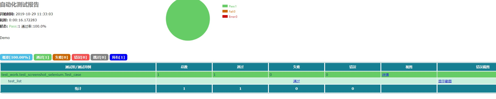

# 项目简介
基于selenium的自动化测试，生成测试用例报告。


## 代码结构

```
├─ Base_config            基础设置
│    ├─ base_appium     初始化driver
│    ├─ HTMLTestRunner_cn 生成的excel报告格式
│   
|    
│  
├─test_case        测试用例
│ 
├─report           测试报告
│   
│ 
├─test_worl    	   测试用例调用组合 
│       
├─main             测试入口
│    
│    
│


```

## 使用说明


1,后续添加


## 报告展示




